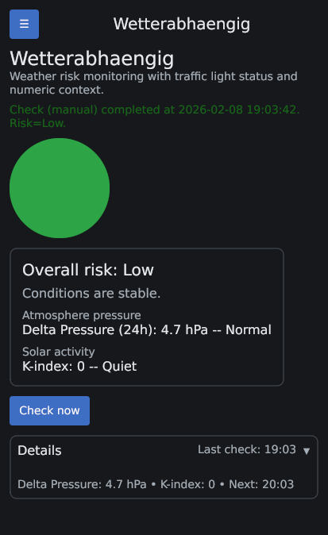
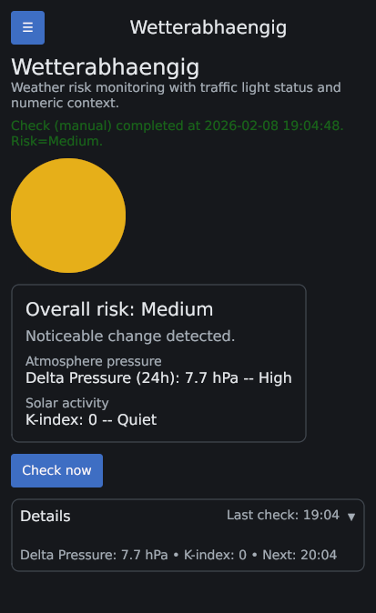
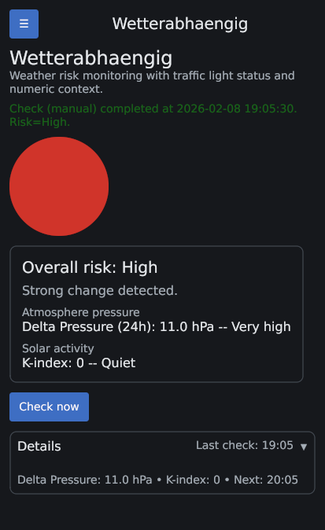
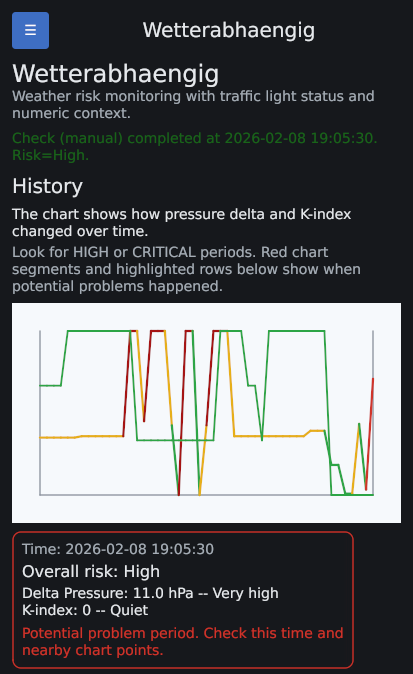
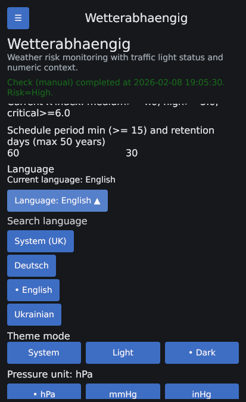
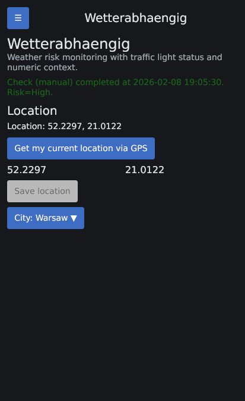
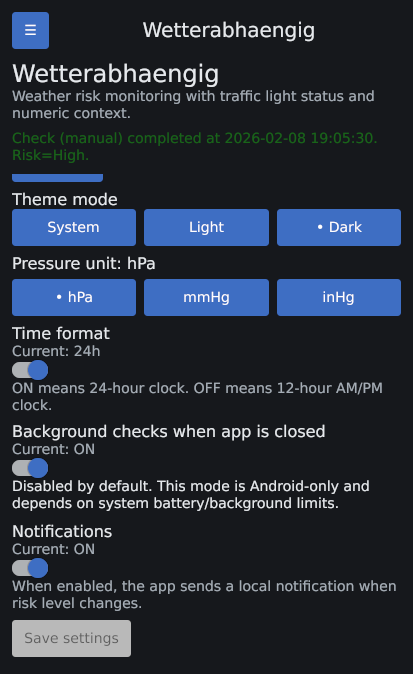

# Wetterabhaengig

Wetterabhaengig is a cross-platform Go + Gio app that monitors weather-related risk and shows a clear traffic-light status with numeric context.

## Purpose

The app is designed for quick risk awareness at a selected location:
- traffic-light style overall risk (`LOW`, `MEDIUM`, `HIGH`, `CRITICAL`)
- source-specific risk from pressure delta and planetary K-index
- clear numeric details so the status is explainable

## Screenshots

## Current Functionality

- Platforms: Linux, Android, Windows, macOS.
- Screens: Home, History, Settings, Location, Test.
- Data sources:
  - Open-Meteo (`surface_pressure`) for 24h pressure delta.
  - NOAA planetary K-index feed.
- Risk calculation:
  - editable thresholds for pressure delta and K-index
  - aggregated overall risk from both sources
- Checks:
  - on startup
  - manual `Check now`
  - scheduled checks while app is running
  - optional Android-only background mode (`disabled` by default):
    - app schedules Android background checks via `ForegroundService` + `AlarmManager`
    - enabled only when `Run scheduled checks while app is closed` is ON in Settings
- Location:
  - manual coordinates
  - city dropdown with search and scroll
  - Android GPS button (`Get my current location via GPS`) with runtime permission flow
- Notifications:
  - Android: native local notifications (runtime permission required on modern Android)
  - Linux: `notify-send`
  - macOS: `osascript`
  - Windows: native toast via PowerShell/WinRT with balloon fallback
  - Test action: available on the `Test` screen and sends an immediate local notification with current app data
- Localization:
  - `System`, `English`, `Deutsch`, `Ukrainian`
  - language selector with dropdown search
  - UI and notification text localized
- Persistent state:
  - settings, location, metrics, history
  - stored in user config dir (`.../wetterabhaengig/state.json`)

## Status Matrix

| Capability | Linux | Android | Windows | macOS |
| --- | --- | --- | --- | --- |
| Core UI (Home/History/Settings/Location/Test) | Implemented | Implemented | Implemented | Implemented |
| Manual `Check now` + in-app scheduling | Implemented | Implemented | Implemented | Implemented |
| Background checks while app window is closed | Not supported | Implemented (optional, settings-controlled) | Not supported | Not supported |
| GPS location button | Not supported | Implemented (runtime permission) | Not supported | Not supported |
| Local notifications | Implemented (`notify-send`) | Implemented (native Android notifications) | Implemented (PowerShell toast/balloon fallback) | Implemented (`osascript`) |
| Localization (System/EN/DE/UK) | Implemented | Implemented | Implemented | Implemented |
| Android APK build flow | N/A | Implemented | N/A | N/A |

## Build Requirements

- Go `1.22+`
- `make`
- For Android build:
  - `gogio` in `PATH` (example: `export PATH="$PATH:$HOME/go/bin"`)
  - Android SDK (`ANDROID_HOME` or `ANDROID_SDK_ROOT`)
  - Android build-tools (`aapt2`, `zipalign`, `apksigner`)
  - `keytool` (for debug keystore generation if needed)
- Android app icon file: `cmd/wetterabhaengig/appicon.png`

## Build Commands

`Makefile` targets:
- `make help` (default)
- `make prepare`
- `make deps`
- `make linux`
- `make windows`
- `make mac` (run on macOS host)
- `make android`
- `make clean`

Build outputs:
- Linux: `build/linux/wetterabhaengig`
- Windows: `build/windows/wetterabhaengig.exe`
- macOS: `build/mac/wetterabhaengig`
- Android APK: `build/android/wetterabhaengig.apk`

## Android Notes

- The Android build script patches and signs the APK with a debug keystore at:
  - `.keys/android-debug.keystore`
- Keep this file stable between builds to avoid install signature mismatch.
- If you already installed an APK signed with a different key, reinstall using:
  - `adb uninstall com.vitovt.wetterabhaengig`
  - `adb install build/android/wetterabhaengig.apk`

## Limitations

- Background checks after closing the app are currently Android-only.
- Android background execution still depends on device battery/background policies (OEM restrictions may delay jobs).
- Desktop notifications depend on available system tooling (`notify-send`, `osascript`, PowerShell), but all desktop backends are implemented.

## TODO

1. Add tests (config validation, risk aggregation, i18n key coverage, API parsing/fallback behavior).
2. Add release-grade signing/versioning flow (debug keystore is fine for dev, not for production releases).
3. Add CI (`go build`, `make linux`, optional Android build/lint checks).
4. Improve UX for API failures/offline mode (clear badges/states on Home screen).

## More Screenshots

